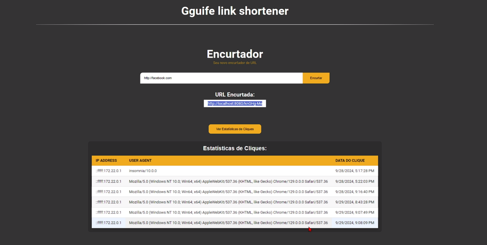

<h1 align="center" style="font-weight: bold;">Encurtador de links💻</h1>

<div align="center">
  
</div>

<p align="center">
 <a href="#tech">Technologies</a> • 
 <a href="#started">Getting Started</a> • 
  <a href="#routes">API Endpoints</a> •
 <a href="#colab">Collaborators</a>
</p>

<p align="center">
    <b>link shortening system, which also collects information, such as IP, browser and link access time.</b>
</p>

<h2 id="technologies">💻 Technologies</h2>

- NodeJS
- Express
- MySQL
- Sequelize
- Docker compose

<h2 id="started">🚀 Getting started</h2>

Here is a step-by-step guide to run your project locally.

<h3>Prerequisites</h3>

Make sure you have the following software installed on your system:

- [NodeJS](https://nodejs.org/en)
- [Docker](https://www.docker.com/products/docker-desktop)
- [Docker Compose](https://docs.docker.com/compose/install/)

<h3>Cloning</h3>

```bash
git clone https://github.com/Gguife/link-shortener
```

<h3>Starting</h3>

How to start project

```bash
1. npm install or yarn install
2. docker-compose up -d
3. npx sequelize db:migrate
4. yarn sequelize db:migrate
```

<h2 id="routes">📍 API Endpoints</h2>

​
| route               | Model     | Description                                     
|----------------------|-----------------------------|------------------------
| <kbd>GET /api</kbd>     | <strong>verify</strong>    | check if the api is online
| <kbd>POST /shorten</kbd>    | <strong>URL</strong>    | shorten the link
| <kbd>DELETE /:hash</kbd> | <strong>URL/Click</strong>    | redirects and stores access information
| <kbd>POST /all-url</kbd>    | <strong>URL</strong>    | see all shortened links
| <kbd>POST /all-click</kbd>    | <strong>Click</strong>    | see all informations


<h2 id="colab">🤝 Collaborators</h2>


  <a href="#">
    <br>
    <sub>
      <b>Guilherme Gomes</b>
    </sub>
  </a>
